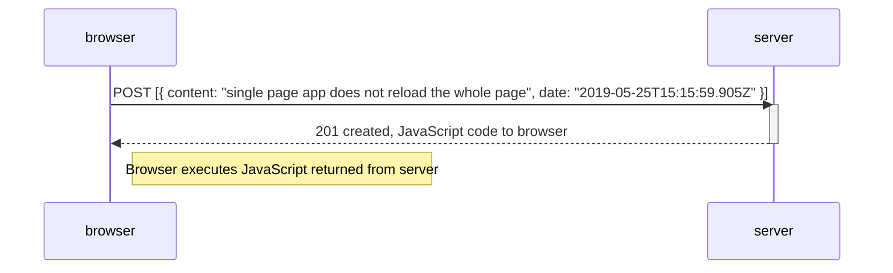

```mermaid
sequenceDiagram
    participant browser
    participant server

    browser->>server: POST [{ content: "single page app does not reload the whole page", date: "2019-05-25T15:15:59.905Z" }] 
    activate server
    server-->>browser: 201 created, JavaScript code to browser
    deactivate server

    Note right of browser: Browser executes JavaScript returned from server
```
